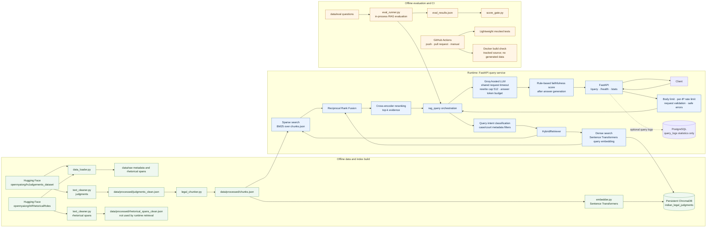
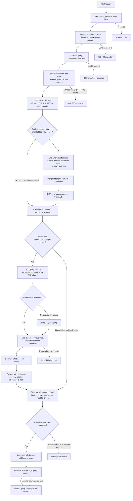

# Indian Legal RAG

A research prototype that retrieves Indian court judgment passages and generates source grounded answers. Phase 1 covers reproducible ingestion, hybrid retrieval, API behavior, evaluation scripts, and optional PostgreSQL query statistics.

## Architecture

The first diagram separates the live API path from local data/index preparation and from evaluation/CI. PostgreSQL stores optional request statistics only; it does not store judgments or vectors. Rhetorical-role spans are produced as an ingestion artifact but are not used by live retrieval. The second diagram shows the query's filtering and bounded recovery paths.

### System architecture

### Query lifecycle and recovery

The live service uses the existing local hybrid retriever and Groq-compatible API client. Evaluation calls the RAG pipeline directly against the configured local index; CI runs mocked/lightweight tests and builds the image, but does not run the full benchmark or create the local index.

## Implemented behavior

- Ingestion downloads OpenNyAI judgment and rhetorical role datasets; preprocessing cleans judgments and chunking produces 1,000 character chunks with 200 character overlap.
- Chunking processes every cleaned judgment by default. Use \`--limit N\` for a local debug run.
- Embeddings use sentence-transformers and are stored in a local ChromaDB collection. Retrieval combines dense ChromaDB results and BM25 results with reciprocal rank fusion, followed by the existing cross encoder reranker.
- \`POST /query\` accepts \`filter_case_type\`; it is applied to dense and BM25 retrieval.
- \`POST /query\` is limited to 30 requests per client IP per 60 seconds by default. Configure \`QUERY_RATE_LIMIT_REQUESTS\` and \`QUERY_RATE_LIMIT_WINDOW_SECONDS\` in \`.env\`. The limit is held in process memory, so it resets on restart and is independent per worker/instance; it is suitable for this single-instance demo, not a distributed deployment.
- The answer generator and query rewrite use a Groq-hosted model through the OpenAI-compatible client. Set \`GROQ_API_KEY\` and \`LLM_MODEL\` in \`.env\`; configure \`LLM_REQUEST_TIMEOUT_SECONDS\` and \`LLM_MAX_OUTPUT_TOKENS\` for the provider timeout and answer output budget. Data downloads can use \`HF_TOKEN\` when required by Hugging Face.
- PostgreSQL query logging is optional. Logging failures are warnings and do not fail a query. \`/stats\` requires a configured, reachable database with the documented \`query_logs\` table.

The project does not currently implement rhetorical role retrieval/classification, citation graph retrieval, NLI faithfulness, agents, or authentication. Evaluation relevance is the mean cross encoder reranker score normalized to 0–1, not a probability of correctness. Faithfulness is a narrow rule based check of whether extracted numbers and legal references appear in retrieved text; it does not establish semantic entailment or legal correctness. Answer overlap is token set F1 after stopword removal. None of these scores are legal quality guarantees.

## Requirements and setup

Use Python 3.11. On Windows, install the same requirements; uvloop is installed only on non Windows platforms.

\`\`\`powershell
py -3.11 -m venv .venv
.venv\Scripts\Activate.ps1
python -m pip install --upgrade pip
python -m pip install -r requirements.txt
Copy-Item .env.example .env
# Add GROQ_API_KEY; add HF_TOKEN if your Hugging Face access needs it
\`\`\`

## Build the local index

The full dataset is the default. These commands download and process the complete datasets and can take substantial time and disk space. Generated files under \`data/\` are intentionally excluded from git and Docker build context.

\`\`\`powershell
python src/ingestion/data_loader.py
python src/ingestion/text_cleaner.py
python src/chunking/legal_chunker.py
python src/embeddings/embedder.py
\`\`\`

For a quick chunking debug run, after preprocessing has created \`data/processed/judgments_clean.json\`, use: \`python src/chunking/legal_chunker.py --limit 50\`. Embedding has its own optional \`max_chunks\` Python argument; the normal script indexes all generated chunks.

## Run the API

\`\`\`powershell
$env:PYTHONPATH = "."
python -m uvicorn src.api.main:app --reload --port 8000
\`\`\`

The API loads the local ChromaDB collection and chunk JSON at startup, so build the index first. Open \`http://localhost:8000/docs\` to inspect the API.

## Evaluation and CI

The full evaluation remains \`python src/evaluation/eval_runner.py\` followed by \`python src/evaluation/score_gate.py data/eval/eval_results.json\`. It uses the existing evaluation dataset, local index, configured LLM generation, and current score gate thresholds (relevance 0.55, faithfulness 0.60, answer overlap 0.10). Metric averages include only eligible observations and include per-metric counts. Overall \`pass\` requires both all questions to return a non-empty answer and all quality thresholds to pass; \`quality_thresholds_pass\` and \`execution_pass\` report those checks separately. Per-question answer status distinguishes completed, empty, failed, and truncated responses. Truncated generations are excluded from answer-quality averages, while retrieval relevance is retained when available. Textual abstentions are treated as completed answers because the output has no explicit abstention marker. Self-heal rate is successful retrieval recoveries divided by questions that triggered a rewrite; per-question records and summary counts distinguish rewrite attempts/successes/failures, retry attempts/successes/failures, and successful/failed recoveries. A failed rewrite can still be followed by one retry using the original query. Evaluation latency excludes the one-second provider throttle. The benchmark is not run automatically in CI.

Push and pull request CI installs \`requirements-ci.txt\` and runs lightweight unit tests with synthetic retrieval results and mocked model services. It does not download judgment data, models, or run the full benchmark.

## Docker

Build the application image without generated data: \`docker build -t indian-legal-rag .\`. To serve queries, first build the local index as above, then mount the generated data directory and provide required environment variables when running the image. For example, in PowerShell:

\`\`\`powershell
docker run --rm -p 8000:8000 -v "$(Resolve-Path data):/app/data" --env-file .env indian-legal-rag
\`\`\`

The image build uses tracked source and pinned direct dependencies. Index files remain local artifacts and must be generated separately.

## Optional PostgreSQL statistics

Set \`DATABASE_URL\` to enable query logging. Create the table before using \`/stats\`:

\`\`\`sql
CREATE TABLE query_logs (
    id SERIAL PRIMARY KEY,
    query TEXT,
    answer_preview TEXT,
    relevance_score FLOAT,
    faithfulness_score FLOAT,
    latency_ms FLOAT,
    cost_usd FLOAT,
    self_healed BOOLEAN,
    detected_intent TEXT,
    created_at TIMESTAMP
);
\`\`\`

## Tests

\`\`\`powershell
python -m pip install -r requirements-ci.txt
python -m unittest tests.test_phase1 -v
python -m unittest tests.test_self_healing_telemetry -v
python -m unittest tests.test_evaluation_audit tests.test_text_cleaner_encoding -v
\`\`\`

## Limitations

This project is for legal research demonstration, not legal advice. The in-memory rate limit is not authentication or a distributed abuse-control mechanism. The BM25 corpus is loaded from the local chunk file at startup, and the local vector index and model downloads are not included in the repository.
